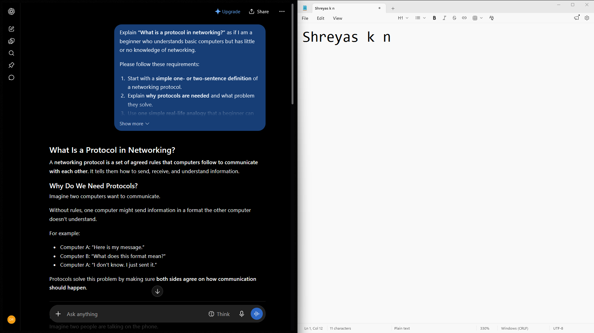
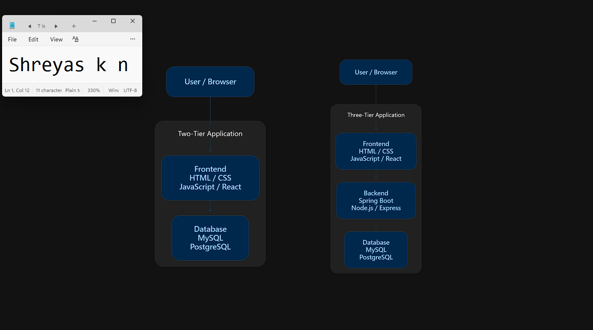
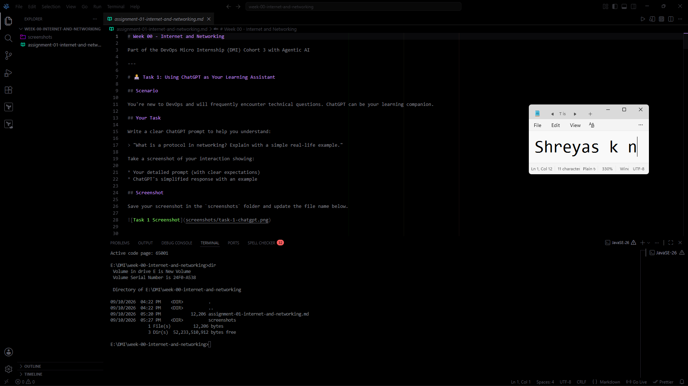

# Week 00 - Internet and Networking

Part of the DevOps Micro Internship (DMI) Cohort 3 with Agentic AI

---

# 🧑‍💻 Task 1: Using ChatGPT as Your Learning Assistant

## Scenario

You're new to DevOps and will frequently encounter technical questions. ChatGPT can be your learning companion.

## Your Task

Write a clear ChatGPT prompt to help you understand:

> "What is a protocol in networking? Explain with a simple real-life example."

Take a screenshot of your interaction showing:

* Your detailed prompt (with clear expectations)
* ChatGPT's simplified response with an example

## Screenshot

Save your screenshot in the `screenshots` folder and update the file name below.




Replace `task-1-chatgpt.png` with your actual screenshot file name.

---

## What I Learned (2–3 lines)

I learned that a network protocol is fundamentally an agreed-upon set of rules that enables different computing systems to communicate reliably, just like etiquette in a phone call (dialing, greeting, speaking in turns). Without standardized protocols, devices across the world wouldn't be able to establish connections or interpret transmitted data.

---

# 🌐 Task 2: Internet and Networking

## Scenario

Your friend is launching an online bookstore named **EpicReads**.

He asked you to explain how users globally can access his website hosted in Finland.

## Your Task

Write a short explanation (**100–150 words**) that includes:

* Packet Switching
* IP Address
* TCP/IP
* HTTP/HTTPS

💡 **Tip:** You may use ChatGPT (as demonstrated in Task 1) to refine your explanation.

## Answer

When a user anywhere in the world visits **EpicReads**, their browser initiates communication across the Internet. The website’s host is located via its unique **IP Address**, which routes the traffic to the server hosted in Finland.

The communication begins when the user's browser sends an **HTTP/HTTPS** request. HTTPS ensures that all data transferred—including customer orders and login credentials—is securely encrypted.

Under the hood, the **TCP/IP** protocol suite governs end-to-end connectivity: IP handles the addressing and routing across intermediary networks, while TCP provides reliable transport, guaranteeing complete and error-checked delivery.

Rather than maintaining a dedicated physical circuit between Finland and the user, the communication relies on **Packet Switching**. The web assets are divided into small, manageable packets that travel independently across global routers and undersea cables along optimal paths, reassembling seamlessly at the user's browser.

---

# 🏗️ Task 3: Application Architecture & Stack

## Scenario

EpicReads bookstore has two application versions:

### Two-Tier Application

* Frontend
* Database

### Three-Tier Application

* Frontend
* Backend
* Database

## Your Task

* Draw simple diagrams (hand-drawn or tool-based such as draw.io)
* Label each layer clearly
* List at least two common technologies or tools used for each layer
* Submit a screenshot or photo clearly showing your own drawing

## Diagram Screenshot / Photo

Save your diagram image in the `screenshots` folder and update the file name below.




Replace `task-3-diagram.png` with your actual diagram file name.

---

## Technologies Used

### Frontend

* **HTML5 / CSS3 / JavaScript** (Core web technologies providing layout, structure, and client-side behavior)
* **React.js** (Modern component-based library for building interactive user interfaces)

### Backend

* **Node.js / Express.js** (Lightweight, asynchronous event-driven JavaScript runtime and REST API framework)
* **Spring Boot (Java)** (Robust enterprise-grade framework for handling business logic and microservices)

### Database

* **PostgreSQL** (Enterprise-level relational database for strong ACID compliance and relational data management)
* **MySQL** (Widely used open-source relational database management system for structured data storage)

---

# 🌍 Task 4: Domain Name & DNS (Basic Concepts)

## Scenario

Your friend's bookstore **EpicReads** is currently accessible through:

```text
52.172.142.222:3000
```

He purchased the domain:

```text
epicreads.com
```

## Your Task

In **50–100 words**, explain in your own words:

1. What is DNS (Domain Name System)?
2. Which DNS record type should be used to connect the domain to the given IP, and why?

## Answer

1. **DNS (Domain Name System)** serves as the Internet's directory service, translating human-friendly domain names like `epicreads.com` into machine-readable IP addresses like `52.172.142.222`.

2. An **A (Address) Record** should be configured to connect `epicreads.com` to `52.172.142.222` because an A record maps domain names directly to IPv4 addresses. Since DNS operates exclusively at the IP level without port mapping, port `3000` is handled at the server level using a reverse proxy (e.g., Nginx) routing port 80/443 traffic to port 3000.

---

# 💻 Task 5: Visual Studio Code Setup (Hands-on)

## Your Task

Install Visual Studio Code (if not already installed).

Take a screenshot of your VS Code environment showing:

* Terminal open inside VS Code
* Running a basic command:

### Windows

```powershell
dir
```

### Linux / macOS

```bash
pwd
ls
```

* Your selected VS Code theme clearly visible

⚠️ **Important:** The screenshot must show your username or another identifiable detail to confirm it is your environment.

## Screenshot

Save your screenshot in the `screenshots` folder and update the file name below.




Replace `task-5-vscode.png` with your actual screenshot file name.

---

# 🔗 Task 6: Publish Your Assignment as a LinkedIn Post

## Objective

Publishing on LinkedIn helps you:

* Build your professional online presence
* Reinforce your learning
* Document your DevOps journey publicly

## Your Task

Summarize your answers from Tasks 1–5 into a LinkedIn post.

Clearly structure your post into the following sections:

* ChatGPT
* Internet & Networking
* App Architecture
* DNS
* VS Code Setup

Use the credit note that matches your track:

Add the following credit note at the end of your post **(If you are DMI Cohort 3 student)**:

> **P.S. This post is part of the DevOps Micro Internship (DMI) with Agentic AI — Cohort 3 — by Pravin Mishra. My graded progress is public: https://dmi.pravinmishra.com/s/YOUR-GITHUB-USERNAME.html · Start your DevOps journey: https://dmi.pravinmishra.com/?utm_source=student&utm_medium=ps-linkedin&utm_campaign=cohort3**

**Tag [Pravin Mishra](https://www.linkedin.com/in/pravin-mishra-aws-trainer/) in your LinkedIn post, then tag Lead Co-Mentor — [Anjana Muthunayake](https://www.linkedin.com/in/anjana-muthunayake/).**

Add the following credit note at the end of your post **(If you are DMI Self-paced track student)**:

> **P.S. This post is part of the DevOps Micro Internship (DMI) — Self-Paced Engineer Track — by Pravin Mishra. My graded progress is public: https://dmi.pravinmishra.com/s/YOUR-GITHUB-USERNAME.html · Start your DevOps journey: https://dmi.pravinmishra.com/?utm_source=student&utm_medium=ps-linkedin&utm_campaign=self-paced**

Add the following credit note at the end of your post **(If you are DMI Campus student)**:

> **P.S. This post is part of the DevOps Micro Internship (DMI) — Campus — by Pravin Mishra. My graded progress is public: https://dmi.pravinmishra.com/s/YOUR-GITHUB-USERNAME.html · Start your DevOps journey: https://dmi.pravinmishra.com/?utm_source=student&utm_medium=ps-linkedin&utm_campaign=campus**

**Tag [Pravin Mishra](https://www.linkedin.com/in/pravin-mishra-aws-trainer/) in your LinkedIn post, then tag Lead Co-Mentor — [Anjana Muthunayake](https://www.linkedin.com/in/anjana-muthunayake/).**

Hashtags:

#DMIByPravinMishra #AgenticAI #DevOps

Replace `YOUR-GITHUB-USERNAME` with your GitHub username — that link is your public DMI progress page (your graded badge page).
---

## LinkedIn Post URL

Paste your LinkedIn post URL here:

```text
https://lnkd.in/p/ggDyeC7b
```

---

## LinkedIn Post Backup Copy

Paste the full text of your LinkedIn post here:

```text
What actually happens under the hood when a user accesses a web application hosted on the other side of the planet?

Starting Week 00 of the DevOps Micro Internship (DMI) with Agentic AI. Before diving into cloud infrastructure and container orchestration, we spent this week deconstructing the foundational networking layers that underpin modern systems:

1. Networking Protocols via First Principles
Used targeted technical prompting to break down network protocols. The simplest mental model is a phone conversation: dialing, waiting for a connection, greeting, taking turns to speak, and terminating the call. Without an agreed-upon sequence of rules, two independent computing systems cannot establish or maintain reliable communication.

2. Global Internet and Data Routing
Analyzed how global traffic reaches an online bookstore (EpicReads) hosted in Finland:
- IP Address: Identifies the specific host on the global network.
- TCP/IP: Governs end-to-end transport. IP handles routing across intermediate network hops, while TCP guarantees complete, in-order packet delivery.
- HTTP/HTTPS: Application layer protocol securing client-server data transfer through TLS encryption.
- Packet Switching: Removes the need for dedicated physical circuits by breaking data into discrete packets routed dynamically across optimal transit paths and reassembled at the destination.

3. Application Architecture: 2-Tier vs 3-Tier
Evaluated the architectural evolution from 2-tier systems (client directly querying the database) to standard 3-tier production environments. Decoupling presentation (React / HTML / CSS) from storage (PostgreSQL / MySQL) via an application logic layer (Spring Boot / Node.js) enables connection pooling, business logic encapsulation, and independent horizontal scaling.

4. DNS and Port Resolution
A domain name serves as a human-readable pointer. An A Record maps that domain to the underlying IPv4 address. Because DNS operates strictly at the IP layer and does not handle port mapping, redirecting traffic to an internal service port (such as 3000) must be handled at the server boundary using a reverse proxy like Nginx.

5. Local Environment
Configured the local VS Code workspace and integrated terminal for the command-line workflows ahead.

Fundamentals locked in. Ready for the next phase.

---

P.S. This post is part of the DevOps Micro Internship (DMI) with Agentic AI — Cohort 3 — by Pravin Mishra. My graded progress is public: https://dmi.pravinmishra.com/s/imshreyaskn.html · Start your DevOps journey: https://dmi.pravinmishra.com/?utm_source=student&utm_medium=ps-linkedin&utm_campaign=cohort3

Mentors: Pravin Mishra & Anjana Muthunayake

#DMIByPravinMishra #AgenticAI #DevOps #CloudEngineering #LearningInPublic
```

---

# Reflection – Week 0

### What did you find easy?

Understanding the role of DNS in domain name resolution and setting up the local VS Code workspace and terminal environment.

---

### What was difficult?

Visualizing how packet switching dynamically balances packets across international transit networks, and understanding that DNS A records do not handle port-level routing.

---

### What will you improve next week?

Spend more time practicing hands-on terminal commands and automating documentation notes alongside practical exercises.

---

## 📌 About DMI & CloudAdvisory

DevOps Micro Internship (DMI) is a project-based DevOps program run by Pravin Mishra (The CloudAdvisory) focused on real-world execution, systems thinking, and career readiness.

It helps learners build strong DevOps foundations with hands-on experience.


## 📌 Resources

- 🌐 **DMI Official Website:** https://dmi.pravinmishra.com?utm_source=github&utm_medium=readme  
- 🎓 **University:** https://university.pravinmishra.com?utm_source=github&utm_medium=readme  
- 💬 **Discord Community:** https://discord.pravinmishra.com?utm_source=github&utm_medium=readme  
- 📝 **Blog:** https://dmi.pravinmishra.com/blog?utm_source=github&utm_medium=readme  
- ▶️ **YouTube Playlist (DMI Cohort 3):** https://www.youtube.com/playlist?list=PLFeSNDtI4Cho  
- 🔗 **Pravin Mishra (LinkedIn):** https://www.linkedin.com/in/pravin-mishra-aws-trainer/  
- 🏢 **CloudAdvisory (LinkedIn):** https://www.linkedin.com/company/thecloudadvisory/

---

*This submission is part of DevOps Micro Internship (DMI) Cohort 3 — Agentic AI Track*